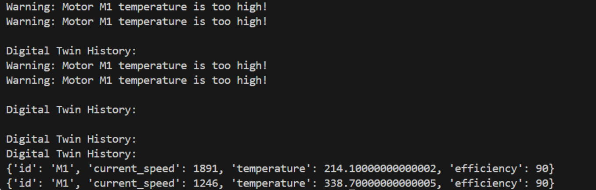

# Digital Twin Motor Simulation

This project simulates a motor's operation using a **Digital Twin** model. The system models a motor's speed, efficiency, and temperature, and tracks the motor's health in real-time. A digital twin is created for the motor to monitor and record its behavior during operation.


## Overview

The program simulates the operation of a motor and its digital twin. The motor has properties such as its `max_speed`, `efficiency`, and `temperature`. The digital twin mirrors the motor's behavior and records its status over time. If the motor's temperature exceeds a certain threshold, the digital twin will output a warning message.
### Output


## Installation

  Python 3.x installed on your system, along with the following dependencies:

- `numpy` (for numerical operations)

we can also install the required dependencies using pip:


```bash
pip install numpy

### Steps

1. **Clone the Repository** (or download the project files):
   ```bash
   git clone https://github.com?umashankar-11/Digital-Twin-for-Industrial-equipment-
   cd Digital-Twin-for-Industrial-equipment-

